# Lieflat Charts

中文 | [English](README.en.md)

[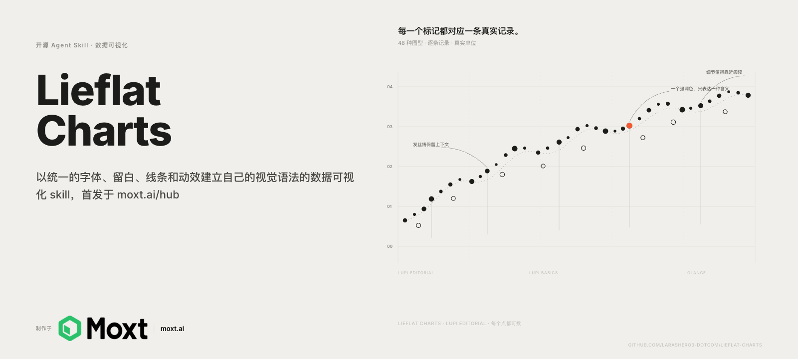](https://moxt.ai/zh-CN/hub?view=skill&id=lieflat-charts)

Lieflat Charts 是一套遵循 Agent Skills 格式的数据可视化与报告生成 skill，可供 moxt、Claude Code、Codex 及其他兼容 `SKILL.md` 的 AI agent 使用。本 skill 在 [moxt.ai](https://moxt.ai) 制作，默认把数据做成有编辑感的图表；只有用户明确要求报告、年报、月报、白皮书、海报或 brief 时，才从 12 套中英文整页模板生成可发布的 HTML 报告。

它以统一的字体、留白、线条和动效建立自己的视觉语法，包括以下几种视觉风格：

- **Lupi（编辑叙事型）**：用细线、点阵、逐条记录和大量留白展开数据，强调真实单位、细节和旁注，适合论文、长文、年报与需要慢慢阅读的数据故事。
- **Glance（快速判断型）**：用粗柱、大数字、色块和清晰排序提前聚合信息，让读者几秒内看懂高低、变化和异常，适合周报、汇报与 dashboard。
- **Basics（基础编辑型）**：保留柱状图、折线图、环形图等熟悉轮廓，再用可数刻度、发丝线和编辑排版增加质感，适合结构简单或数据量较少的内容。

此外还提供网络、路径和多段流向等独立交互大图。每张图都尽量保留数据的真实单位，同时让标题、旁注、来源和页面结构参与表达。

Mono 黑白灰是稳定的保底方案，同时也有彩色模式，目前支持青瓷蓝、椰林绿和编辑部红三种彩色色系，方便适配各种场景的数据可视化。Agent 会根据数据结构和使用场景，在 Mono、青瓷蓝、椰林绿或编辑部红之间自动选择；适配关系不明确时使用 Mono。用户明确提供品牌色或色值时，也可以建立一套 custom 色板。同一份 HTML 或同一组图只使用一种色彩系统，生成后仍可继续调色，同时保持图型结构、比例、对比度和数据契约。

## Preview

以下是几类模板的实际预览。

### Lupi Editorial

细读、逐记录、编辑感。精选 19 张编辑叙事型模板中的代表图型。

<table>
  <tr>
    <td width="50%"></td>
    <td width="50%"></td>
  </tr>
  <tr><td colspan="2"></td></tr>
</table>

### Glance

快读、聚合、结论先行。精选 20 张快速判断型模板中的代表图型。

<table>
  <tr>
    <td width="50%"></td>
    <td width="50%"></td>
  </tr>
</table>

动态预览：

<p align="center"></p>

更多动态预览：

<table>
  <tr>
    <td width="33%"><br><strong>Fifty markets</strong></td>
    <td width="33%"><br><strong>Eight products race</strong></td>
    <td width="33%"><br><strong>H1 revenue</strong></td>
  </tr>
</table>

### Lupi Basics

常见图型与可数单位的结合。17 张模板覆盖柱、线、面积、环形、散点、矩形树图、直方图、箱线图、K 线等基础数据形状。

<table>
  <tr>
    <td width="50%"></td>
    <td width="50%"></td>
  </tr>
</table>

### Interactive

用于网络、路径与高密度关系数据。

动态预览：

<p align="center"></p>

[打开 Force Graph 模板体验拖拽与缩放](https://larashero3-dotcom.github.io/lieflat-charts/templates/big-force.html)

## 增加了彩色模式

图表可以根据数据结构和使用场景自动选择 Mono 或一套彩色预设，不要求用户先说“要彩色”。有序单序列可使用青瓷蓝，少量无序类目可使用椰林绿，需要一个受控视线落点时可使用编辑部红；适配关系不明确时回到 Mono。用户明确给出品牌色或色值时，可以建立一套 custom 色板。同一份 HTML 或同一组图只使用一种色彩系统；调整时需重新检查对比度、视觉主次和颜色所表达的数据含义。

#### Porcelain · 青瓷蓝

单色相明度阶，适合有序数据和单序列。

<p align="center"></p>

<p align="center"></p>

<table>
  <tr>
    <td width="100%"><br><strong>Basics</strong></td>
  </tr>
  <tr><td colspan="2"><br><strong>Lupi Editorial</strong></td></tr>
</table>

#### Palm · 椰林绿

低饱和绿黄色系，用色相区分少量无序类目。

<p align="center"></p>

<p align="center"></p>

<table>
  <tr>
    <td width="100%"><br><strong>Basics</strong></td>
  </tr>
  <tr><td colspan="2"><br><strong>Lupi Editorial</strong></td></tr>
</table>

#### Wire · 编辑部红

黑灰阶加一个荧光橙视线落点。

<p align="center"></p>

<p align="center"></p>

<table>
  <tr>
    <td width="100%"><br><strong>Basics</strong></td>
  </tr>
  <tr><td colspan="2"><br><strong>Lupi Editorial</strong></td></tr>
</table>

## 最新更新

### 增加了报告模式

现在可以在单张图表之外，直接从 12 套整页报告模板生成 HTML 报告。每套模板都提供中文版和英文版，覆盖调研报告、研究简报、业务数据报告、财报与金融经济分析、产品记录、dashboard、海报，以及运动、旅行和年度生活数据记录等从工作到个人的需求。模板名称代表版式性格，不是使用场景的限制；同一套模板可以根据数据结构迁移到不同类型的报告。

<table>
  <tr>
    <td width="25%">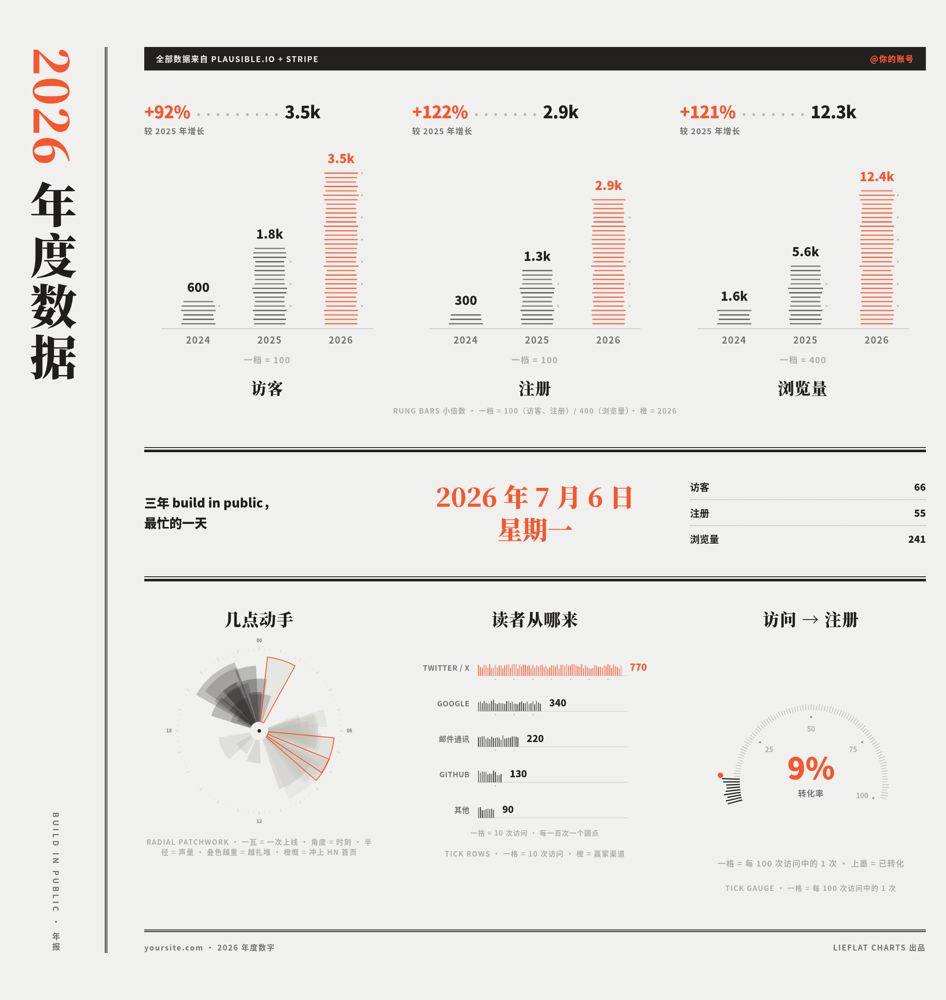<br><strong>R03 · 年度数据报告 / 年度海报</strong></td>
    <td width="25%">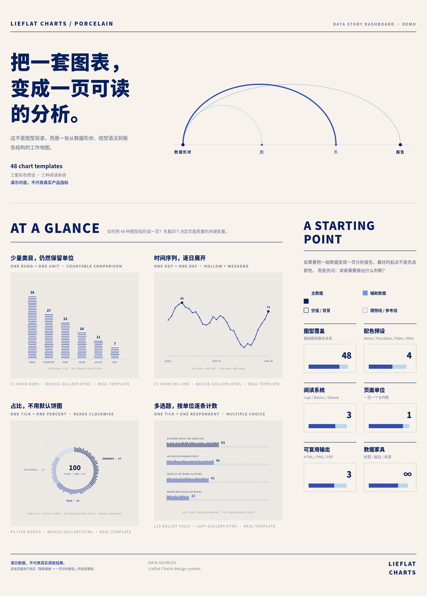<br><strong>R09 · 业务数据 / 财务经营 Dashboard</strong></td>
    <td width="25%">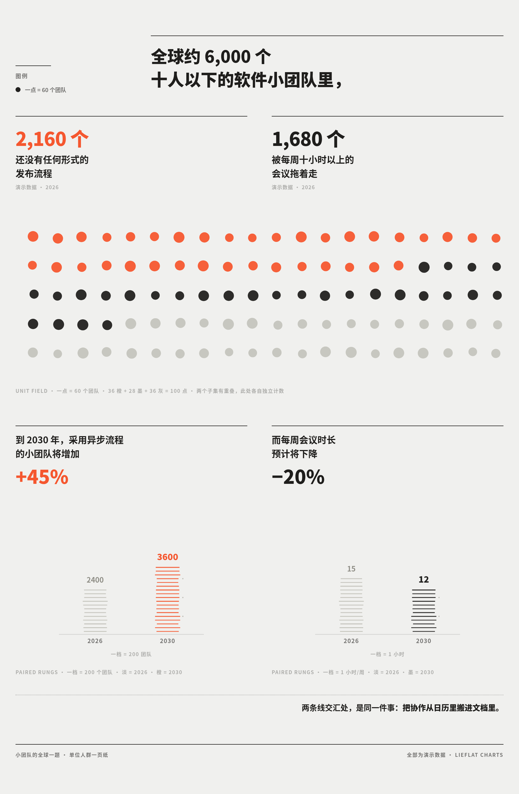<br><strong>R08 · 人群 / 社会经济数据一页</strong></td>
    <td width="25%">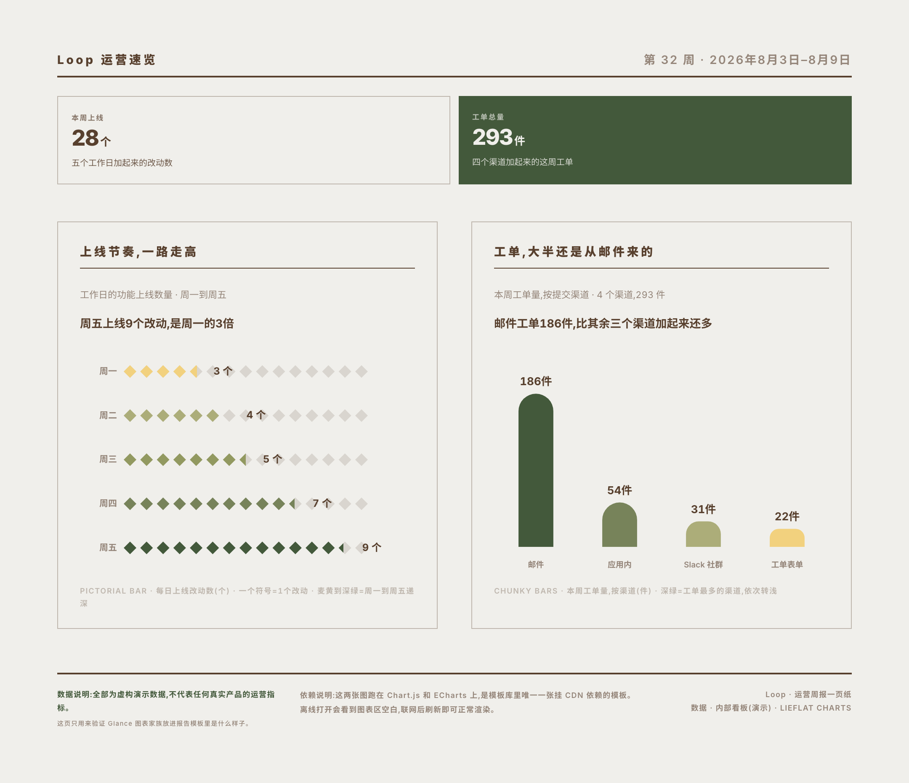<br><strong>R12 · 周期数据快报 / 监控摘要</strong></td>
  </tr>
  <tr>
    <td width="25%">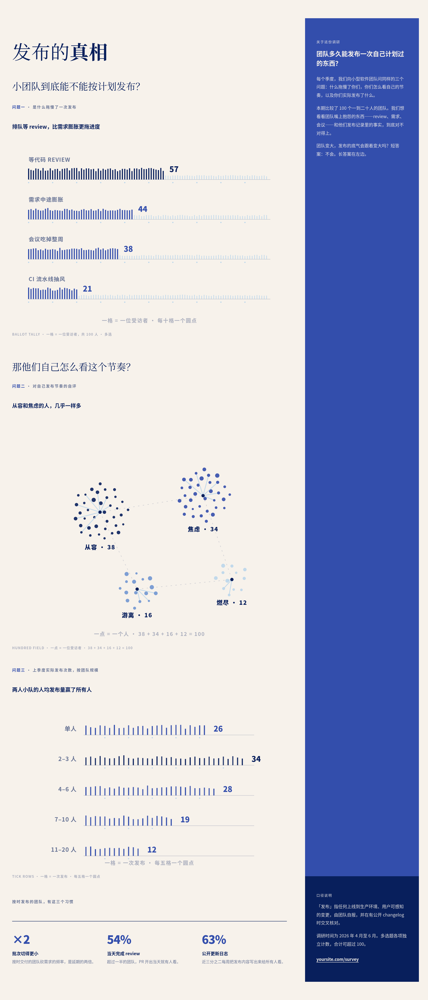<br><strong>R01 · 调研报告 / 研究一页</strong></td>
    <td width="25%">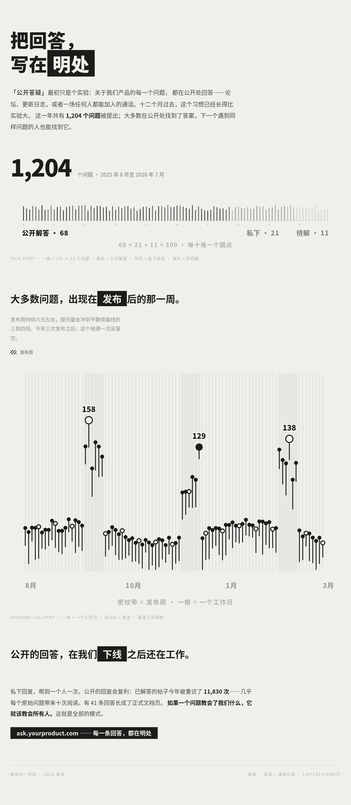<br><strong>R05 · 项目 / 产品影响力故事</strong></td>
    <td width="25%">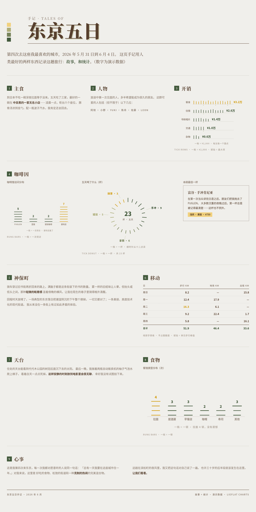<br><strong>R10 · 个人数据 / 运动 / 旅行记录</strong></td>
    <td width="25%">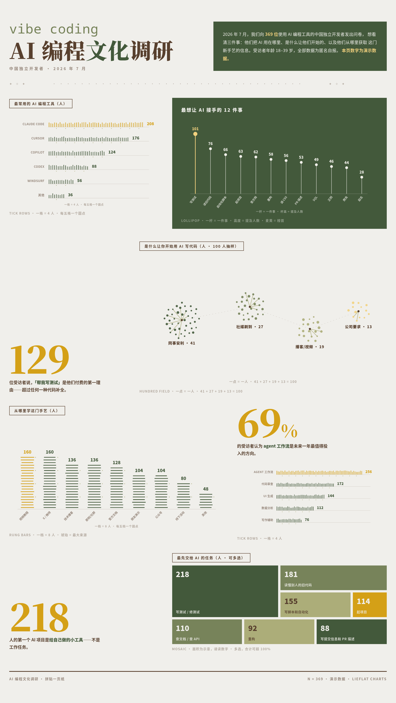<br><strong>R07 · 调研 / 市场数据拼贴海报</strong></td>
  </tr>
  <tr>
    <td width="25%">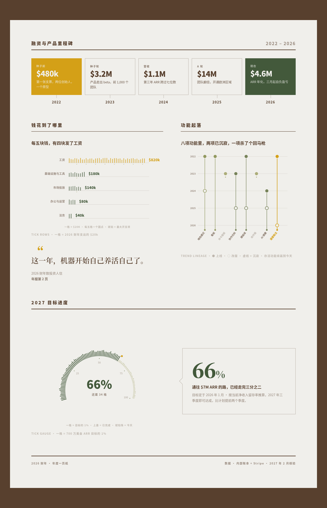<br><strong>R02 · 年度复盘 / 业绩回顾</strong></td>
    <td width="25%">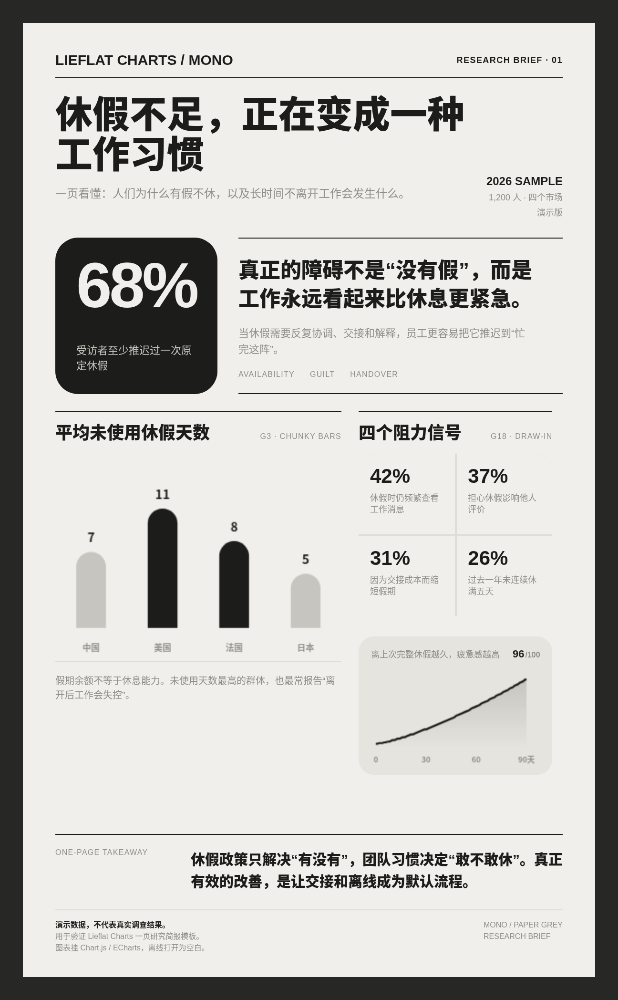<br><strong>R11 · 研究 / 金融经济简报卡</strong></td>
    <td width="25%">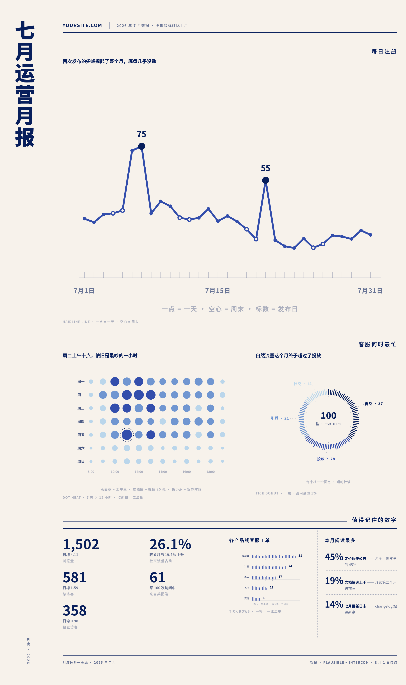<br><strong>R04 · 月度业务 / 财务经营报告</strong></td>
    <td width="25%">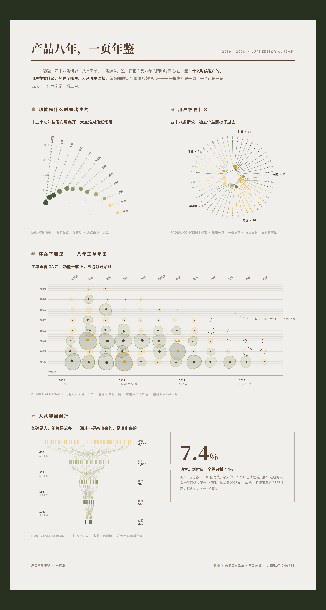<br><strong>R06 · 长周期产品 / 业务年鉴</strong></td>
  </tr>
</table>

## 零门槛快速使用

### 推荐在 Moxt 中使用

[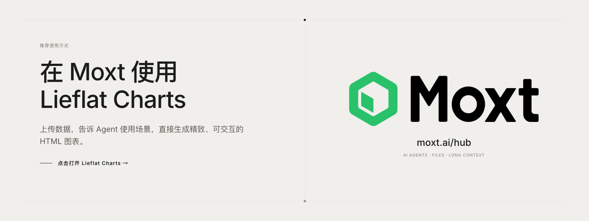](https://moxt.ai/zh-CN/hub?view=skill&id=lieflat-charts)

Lieflat Charts 在 [Moxt](https://moxt.ai/zh-CN/hub?view=skill&id=lieflat-charts) 中完成设计、测试和持续迭代。它的设计规则、模板结构与文件工作流，都是围绕 Moxt 的 Agent 协作方式反复打磨的。

因此，在 Moxt 中使用时，Agent 能更顺畅地读取完整的设计规范、理解 Lieflat Charts 的视觉语言、调用对应模板，并在同一个工作区中持续预览和修改结果，更稳定地执行这套设计。

| Lieflat Charts 的工作环节 | 普通的一问一答方式 | 在 Moxt 中 |
|---|---|---|
| 理解设计语言 | 需要从 Skill 文件重新建立理解 | Skill 已在相同的 Agent 工作环境中完成设计和验证 |
| 读取规则、模板和数据 | 通常需要反复上传文件或提供路径 | 规则、模板、数据和成品可以保留在同一个工作区 |
| 多轮选择和修改图表 | 更换对话后可能需要重新说明背景 | Agent 可以沿用工作区中的文件和上下文继续修改 |
| 生成最终结果 | 结果可能停留在对话或临时目录中 | HTML 成品可以和数据、模板一起留在工作区继续完善 |

Lieflat Charts 仍然可以安装到其他支持 Agent Skills 的工具中；Moxt 是它的原生制作环境，也是目前更完整、步骤更短的推荐使用方式。

### 安装到其他 Agent

一条命令安装：

```bash
npx skills add https://github.com/larashero3-dotcom/lieflat-charts --skill lieflat-charts
```

也可以直接把这段话发给有 shell 权限的 AI Agent：

```text
帮我安装 lieflat-charts。请把 https://github.com/larashero3-dotcom/lieflat-charts
克隆到 ~/.claude/skills/lieflat-charts，安装完成后检查 SKILL.md、templates/、
catalog.md 和 mono-tokens.js 是否存在。
```

使用 Codex 时，将安装路径换成 `~/.codex/skills/lieflat-charts`。

已经安装过的话，用这段话更新：

```text
帮我更新 lieflat-charts。请进入 ~/.claude/skills/lieflat-charts 执行 git pull，
然后告诉我当前最新 commit。
```

安装后直接对 Agent 说：

```text
把这份调研数据做成适合公众号长文的 5 张中文版图表。
默认先比较 Lupi Editorial 和 Lupi Basics 候选；两组都不适配时，再使用 Glance。
```

也可以试这些请求：

```text
帮我用 lieflat charts 给这些数据做个彩色风格的图表。
```

```text
读这篇论文，找出最值得讲的几个数据结论，做成一页完整的 HTML 图表。
```

```text
这是一份周报数据，要求 10 秒内看懂排名、变化和异常。
```

```text
把这个 CSV 做成一张适合放进汇报里的 Glance 图表。
```

```text
用 Lupi 风格重新设计这组数据，保留每条真实记录，并加入必要的旁注。
```

```text
用青瓷蓝预设重做这张图，用明度深浅表示数值大小，不改变原图的结构。
```

图数由独立结论决定：单个问题通常 1 张，两个到三个结论 2–3 张，完整文章或论文 4–6 张，单页默认最多 6 张。用户明确指定数量时会遵守，但不会为了凑数重复表达同一个结论。

## 关注躺在废墟里

欢迎在小红书、抖音、Bilibili、公众号、视频号和 X 关注我：**躺在废墟里**。

<p align="center">
  
</p>

## Templates

| 类型 | 数量 | 适合什么 | 实现 |
|---|---:|---|---|
| **Lupi Editorial** | 15 | 年报、论文、公众号、海报、作品集；读者愿意停下来细看 | 手写 SVG |
| **Lupi Basics** | 13 | 柱、折线、面积、环形、散点、瀑布、热力、进度、矩形树图等基础数据形状 | 手写 SVG / ECharts |
| **Glance** | 18 | 周报、dashboard、监控、汇报；需要快速排序和比较 | Chart.js / ECharts |
| **Interactive** | 3 | 网络、路径、多段流向和高密度关系数据 | ECharts / SVG |
| **Color Presets** | 3 套 / 15 个样张 | 需要颜色区分数据维度，或为 Mono 加一个受控视线落点 | 基于原模板换肤 |
| **Report Templates** | 12 套 / 中英双版 | 调研、年报、月报、仪表盘、海报、简报和个人记录等完整整页报告 | 单文件 HTML |

### Lupi Editorial

把一个点、一根线或一条旁注尽量对应到真实数据单位。它不急着把数据聚合成一个结论，而是把原材料摊开，让读者看到结构、分布和例外。视觉上使用发丝线、留白、账本式导轨、旁注和低对比灰阶，阅读时间通常在 30 秒以上。

### Lupi Basics

保留常见图表的剪影，但把它们放进 Lupi 的编辑语法里：一格可以是一个百分点，一根 tick 可以是一个人，一条 hairline 可以是一天，Treemap 的一块面积可以对应一个真实权重。它适合数据不多、但仍然希望画面有密度和可读单位的场景。

### Glance

提前聚合、加粗主要形状，把关键排序和变化放到第一眼。它不是“低配版 Lupi”，而是另一种阅读速度：读者不需要展开每条记录，也能在几秒内知道谁更高、哪里变化最大、哪个指标需要关注。

### Interactive

用于普通静态图承载不了的关系数据。通过 hover、聚焦、拖拽、固定路径和状态栏，把“看起来很复杂”的网络变成可以逐条查询的图。交互只服务于真实记录，不给纯装饰元素添加假的行为。

## Design

所有体系共享一套 Mono 视觉语法：纸灰与炭黑两极，加上中间灰阶；明度承担层级，位置、长度、密度和结构承担数据编码。三套彩色预设提供稳定的配色起点；用户明确给出品牌色时，也可以建立角色完整、对比度合格的 custom 色板。继续调色时，仍需保证视觉主次和数据含义清楚。创新不在于再发明一种孤立图型，而在于把图型选择、编辑排版、浏览器交互和整页叙事放进同一个可复用的 skill。

因此，Lieflat Charts 和过去直接做 charts 的差别，不只是“换了颜色”：

- 先判断数据契约，再选图型，而不是先挑一个库内模板
- 每张图先承担一个独立结论，再组成整页，而不是把所有字段都画上去
- 把真实数据单位作为视觉原子，不用装饰性噪声伪造密度
- 把标题、旁注、来源、留白和动效视为图表的一部分
- 用 Lupi 和 Glance 表达两种阅读速度，而不是把静态图和交互图当成唯一分类

## Structure

```text
.
├── README.md                # 中文项目说明
├── README.en.md             # English project guide
├── SKILL.md                 # Agent 使用的工作流与规则
├── catalog.md               # 49 个图型的数据契约索引
├── report-catalog.md        # 12 套整页报告模板的场景索引
├── mono-tokens.js           # 共享视觉 token
├── color-presets.js         # 三套内置彩色预设
├── templates/               # Lupi、Basics、Glance、交互与报告模板
│   ├── color/               # 彩色换肤样张
│   └── reports/             # 12 套报告模板，每套中英文双版
├── examples/                # 真实公开数据案例
├── docs/assets/             # README 模板截图与动态预览
└── scripts/validate.mjs     # 发布前检查
```

直接打开 `templates/` 下的 HTML 文件即可查看 gallery；打开 `templates/reports/index.html` 可浏览报告模板并进入中英文版本。报告模式先从 `report-catalog.md` 选整页骨架，再为各图表槽位复用 `catalog.md` 中的真实图型。Lupi 和 Basics 主要使用原生 SVG，F13 Treemap 使用 ECharts；Glance、Circular、Force 以及报告模板 R11/R12 通过 CDN 加载 Chart.js 或 ECharts，需要联网才能完整显示。

## License

本项目使用 [PolyForm Noncommercial License 1.0.0](LICENSE)。允许学习、修改、分享和非商业使用；商业使用需要另行取得许可。

Chart.js、Apache ECharts 和 Inter 字体遵循各自的原始许可证，详见 [THIRD_PARTY_NOTICES.md](THIRD_PARTY_NOTICES.md)。
