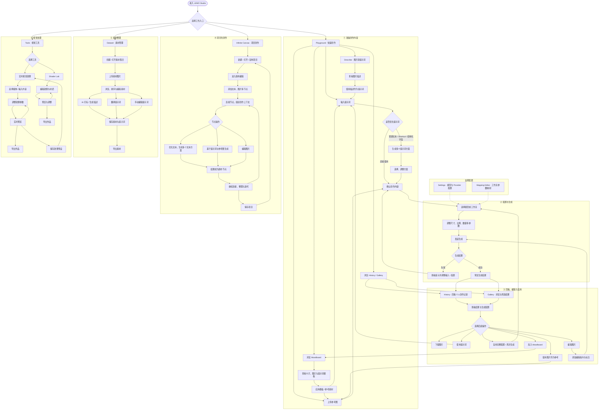

# LEMO Studio 流程图

帮我做一个diagram图，内容是flowchart TD Start(\["进入 LEMO Studio"]) --> Entry{"选择工作入口"} Entry --> Playground\["Playground · 快速创作"] Entry --> Canvas\["Infinite Canvas · 项目创作"] Entry --> Dataset\["Dataset · 素材管理"] Entry --> Tools\["Tools · 视觉工具"] subgraph Creation\["① 准备创作内容"] Playground --> Input\["输入提示词"] Playground --> Reference\["上传参考图"] Playground --> Describe\["Describe · 图片转提示词"] Playground --> Moodboard\["浏览 Moodboard"] Playground --> Browse\["浏览 History / Gallery"] Describe --> Description\["查看图片描述"] Description --> UseDescription\["使用描述作为提示词"] UseDescription --> Input Moodboard --> MoodDetail\["查看卡片、图片与提示词模板"] MoodDetail --> ApplyTemplate\["应用模板 / 参考素材"] ApplyTemplate --> Input ApplyTemplate --> Reference Input --> Optimize{"是否优化提示词"} Optimize -->|"直接使用"| Ready\["确认创作内容"] Optimize -->|"普通文本 / Shortcut / 结构化字段"| Variants\["生成多个提示词方案"] Variants --> SelectVariant\["选择、调整方案"] SelectVariant --> Ready Reference --> Ready end subgraph Generation\["② 配置与生成"] Ready --> Model\["选择模型或工作流"] Model --> Params\["调整尺寸、比例、数量等参数"] Params --> Generate\["发起生成"] Generate --> Status{"生成结果"} Status -->|"失败"| Fix\["查看提示并调整输入 / 配置"] Fix --> Ready Status -->|"成功"| Result\["预览生成结果"] end subgraph Reuse\["③ 回看、编辑与复用"] Result --> History\["History · 回看个人创作记录"] Result --> Gallery\["Gallery · 浏览与筛选结果"] Browse --> History Browse --> Gallery History --> Detail\["查看结果与生成配置"] Gallery --> Detail Detail --> Action{"选择后续操作"} Action --> Download\["下载图片"] Action --> ReusePrompt\["使用提示词"] Action --> ReuseImage\["使用图片作为参考"] Action --> ReuseConfig\["复用完整配置 / 再次生成"] Action --> Edit\["编辑图片"] Action --> Collect\["加入 Moodboard"] ReusePrompt --> Input ReuseImage --> Reference ReuseConfig --> Model Edit --> Annotation\["添加编辑指令与标注"] Annotation --> Generate Collect --> Moodboard end subgraph Project\["④ 项目化创作"] Canvas --> ProjectList\["新建 / 打开 / 复制项目"] ProjectList --> CanvasEdit\["进入画布编辑"] CanvasEdit --> Nodes\["添加文本、图片等节点"] Nodes --> Connect\["连接节点，组织创作上下文"] Connect --> NodeAction{"节点操作"} NodeAction --> NodeOptimize\["优化文本，生成多个文本方案"] NodeAction --> NodeGenerate\["基于提示词与参考图生成"] NodeAction --> NodeEdit\["编辑图片"] NodeOptimize --> CanvasResult\["结果成为画布节点"] NodeGenerate --> CanvasResult NodeEdit --> CanvasResult CanvasResult --> Arrange\["继续连接、整理与迭代"] Arrange --> Connect Arrange --> SaveProject\["保存项目"] SaveProject --> ProjectList end subgraph Assets\["⑤ 素材整理"] Dataset --> Collections\["创建 / 打开素材集合"] Collections --> Upload\["上传素材图片"] Upload --> Manage\["浏览、排序与编辑素材"] Manage --> Label\["AI 打标 / 生成描述"] Manage --> Translate\["翻译提示词"] Manage --> Manual\["手动编辑提示词"] Label --> SaveAssets\["保存素材与提示词"] Translate --> SaveAssets Manual --> SaveAssets SaveAssets --> ExportAssets\["导出素材"] end subgraph Effects\["⑥ 视觉处理"] Tools --> ToolChoice{"选择工具"} ToolChoice --> Effect\["实时视觉效果"] Effect --> Media\["选择媒体 / 输入内容"] Media --> Adjust\["调整效果参数"] Adjust --> Preview\["实时预览"] Preview --> Adjust Preview --> Export\["导出作品"] Preview --> Preset\["保存效果预设"] Preset --> Effect ToolChoice --> ShaderLab\["Shader Lab"] ShaderLab --> ShaderEdit\["编辑效果与材质"] ShaderEdit --> ShaderPreview\["预览与调整"] ShaderPreview --> ShaderEdit ShaderPreview --> ShaderExport\["导出作品"] end subgraph Configuration\["支撑配置"] Settings\["Settings · 模型与 Provider 配置"] -.-> Model Mapping\["Mapping Editor · 工作流参数映射"] -.-> Model end
